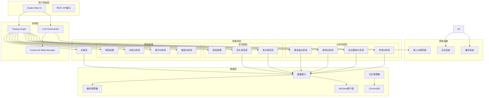
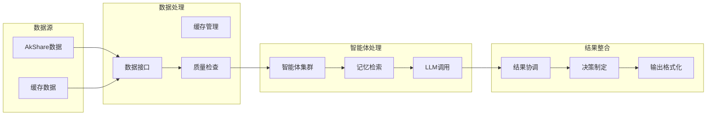

# 🧬 架构DNA分析报告
## Multi-AI Cooperative Stock Analysis系统逆向工程

### 📊 执行摘要

本报告通过逆向工程方法，深度解构了Multi-AI Cooperative Stock Analysis系统的技术架构、设计模式和核心机制。该系统是一个基于15个专业化LLM智能体的金融分析框架，采用分层协作架构，实现了从数据收集到投资决策的完整闭环。

---

## 1. 技术栈逆向分析

### 1.1 核心技术栈
```yaml
当前技术栈:
  后端框架: Python 3.8+ 异步架构
  AI/ML: 
    - OpenAI GPT-4/3.5-turbo
    - DeepSeek Chat API
    - Google Gemini系列
    - Moonshot AI
  数据层:
    - AkShare (A股数据)
    - ChromaDB (向量存储)
    - Sentence-Transformers (嵌入)
  前端:
    - Gradio 4.x (Web界面)
  基础设施:
    - 异步IO (asyncio)
    - 缓存系统 (内存+磁盘)
    - 日志系统 (结构化日志)
```

### 1.2 关键技术债识别
```yaml
需保持的特性:
  - 15个智能体的专业化分工
  - 多轮辩论决策机制
  - 向量记忆存储系统
  - 实时数据获取能力
  - 异步并行处理架构

需改进的缺陷:
  - 硬编码的API密钥管理
  - 单点故障风险 (LLM依赖)
  - 数据源的单一性 (主要依赖AkShare)
  - 缺乏分布式部署支持
  - 错误恢复机制不够完善
```

---

## 2. 组件依赖矩阵 (Mermaid语法)

### 2.1 系统级依赖图


### 2.2 数据流依赖图


---

## 3. 状态管理机制解剖

### 3.1 状态管理架构
```python
class StateManagementDNA:
    """状态管理机制的核心DNA"""
    
    # 1. 会话状态管理
    class SessionState:
        session_id: str
        conversation_count
