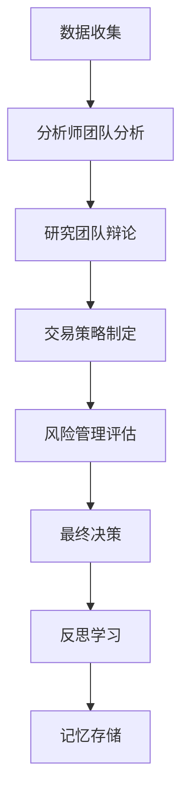

# 🤖 TradingAgents - 多智能体协作股票分析系统

**基于15个专业化LLM智能体的金融交易分析框架**

## 📋 项目概述

TradingAgents是一个创新的多智能体协作系统，专门用于股票投资分析和决策支持。系统通过15个专业化的LLM智能体协作，提供全方位的股票分析，包括技术分析、基本面分析、情绪分析、风险评估等。

### 🎯 核心特性

- **15个专业智能体**: 分工明确的专业化智能体团队
- **多层次分析**: 技术面、基本面、情绪面、宏观面全覆盖
- **协作决策**: 多空辩论、风险评估、最终决策
- **实时数据**: 支持AkShare等多种数据源
- **记忆系统**: 基于ChromaDB的向量记忆存储
- **可视化界面**: 基于Gradio的现代化Web界面

## 🏗️ 系统架构

### 智能体团队结构

```
TradingAgents System
├── 📊 分析师团队 (Analysts)
│   ├── 📈 市场分析师 (MarketAnalyst)
│   ├── 💭 社交媒体分析师 (SocialMediaAnalyst)
│   ├── 📰 新闻分析师 (NewsAnalyst)
│   └── 📊 基本面分析师 (FundamentalsAnalyst)
├── 🔬 研究团队 (Researchers)
│   ├── 🐂 多头研究员 (BullResearcher)
│   ├── 🐻 空头研究员 (BearResearcher)
│   └── 👨‍💼 研究经理 (ResearchManager)
├── 💼 交易团队 (Trading)
│   └── 👨‍💻 交易员 (Trader)
├── ⚠️ 风险管理团队 (Risk Management)
│   ├── 🔴 激进分析师 (AggressiveDebator)
│   ├── 🔵 保守分析师 (ConservativeDebator)
│   ├── 🟡 中性分析师 (NeutralDebator)
│   └── 👨‍⚖️ 风险经理 (RiskManager)
└── 🧠 支持系统 (Support)
    ├── 💾 记忆管理器 (MemoryManager)
    ├── 📡 信号处理器 (SignalProcessor)
    └── 🔄 反思引擎 (ReflectionEngine)
```

### 工作流程



## 🚀 快速开始

### 环境要求

- Python 3.8+
- 支持的LLM API (DeepSeek/OpenAI/Google等)
- 可选: ChromaDB (用于记忆系统)
- 可选: AkShare (用于股票数据)

### 安装依赖

```bash
# 基础依赖
pip install gradio asyncio

# 可选依赖 (完整功能)
pip install chromadb sentence-transformers akshare pandas numpy
```

### 运行演示

```bash
# 运行简单演示
python run_demo.py

# 运行完整系统 (需要配置LLM API)
python app_new.py
```

### 配置LLM

在 `core/llm_orchestrator.py` 中配置您的LLM API:

```python
# 示例配置
LLM_CONFIG = {
    "provider": "deepseek",  # 或 "openai", "google"
    "api_key": "your-api-key",
    "model": "deepseek-chat",
    "base_url": "https://api.deepseek.com"
}
```

## 📊 使用指南

### 基本使用

1. **输入股票代码**: 支持A股代码 (如: 000001, 600036)
2. **选择分析深度**: 浅层/中等/深度分析
3. **配置智能体**: 选择参与分析的智能体团队
4. **执行分析**: 点击开始分析，等待结果
5. **查看报告**: 多标签页展示详细分析结果

### 分析深度说明

- **浅层分析**: 1轮辩论，快速分析 (~2分钟)
- **中等分析**: 3轮辩论，平衡分析 (~5分钟)
- **深度分析**: 5轮辩论，全面分析 (~10分钟)

### 结果解读

系统提供多层次的分析结果:

1. **综合报告**: 最终投资决策和关键洞察
2. **分析师报告**: 各专业分析师的详细分析
3. **多空辩论**: 多头和空头的论据对比
4. **交易策略**: 具体的交易执行建议
5. **风险评估**: 多角度的风险分析
6. **原始数据**: 完整的分析数据结构

## 🔧 技术细节

### 核心组件

#### 1. 智能体基类 (BaseAgent)
- 统一的智能体接口
- LLM交互管理
- 记忆系统集成
- 错误处理和重试

#### 2. 工作流图 (TradingGraph)
- 智能体协调和调度
- 分析流程管理
- 状态跟踪和监控

#### 3. 数据接口 (DataInterface)
- 多数据源集成
- 数据缓存和管理
- 实时数据更新

#### 4. 记忆系统 (MemoryManager)
- 向量化记忆存储
- 智能体经验学习
- 历史分析回顾

### 扩展开发

#### 添加新智能体

```python
from tradingagents.agents.base_agent import BaseAgent

class CustomAnalyst(BaseAgent):
    def __init__(self, llm_client=None, memory_manager=None):
        super().__init__(
            agent_id="custom_analyst",
            agent_type="自定义分析师",
            llm_client=llm_client,
            memory_manager=memory_manager
        )
    
    async def analyze(self, input_data, context):
        # 实现自定义分析逻辑
        pass
```

#### 添加新数据源

```python
from tradingagents.dataflows.interface import DataInterface

class CustomDataSource:
    async def get_stock_data(self, symbol):
        # 实现数据获取逻辑
        pass
```

## 📈 性能优化

### 缓存策略
- 数据缓存: 5分钟TTL
- 分析结果缓存: 30分钟TTL
- 记忆向量缓存: 持久化存储

### 并发处理
- 智能体并行执行
- 异步数据获取
- 非阻塞用户界面

### 资源管理
- 内存使用监控
- LLM调用限流
- 错误恢复机制

## ⚠️ 注意事项

### 免责声明
- 本系统提供的分析结果仅供参考
- 不构成投资建议或推荐
- 投资有风险，决策需谨慎
- 请结合专业投资顾问意见

### 使用限制
- 需要有效的LLM API密钥
- 数据源可能有访问限制
- 分析结果依赖于数据质量
- 系统性能取决于硬件配置

## 🤝 贡献指南

欢迎贡献代码、报告问题或提出改进建议:

1. Fork 项目
2. 创建特性分支
3. 提交更改
4. 发起 Pull Request

### 开发规范
- 遵循 PEP 8 代码风格
- 添加适当的文档和注释
- 编写单元测试
- 更新相关文档

## 📄 许可证

本项目采用 MIT 许可证 - 详见 [LICENSE](LICENSE) 文件

## 🙏 致谢

- **AkShare**: 提供股票数据支持
- **ChromaDB**: 向量数据库支持
- **Gradio**: Web界面框架
- **LLM提供商**: DeepSeek, OpenAI, Google等

## 📞 联系方式

- 项目主页: [GitHub Repository]
- 问题反馈: [Issues]
- 讨论交流: [Discussions]

---

**TradingAgents v1.0** | Powered by Multi-Agent LLM Framework

*让AI智能体团队为您的投资决策提供专业支持*
"# Multi-AI-Cooperative-Stock-Analysis" 
